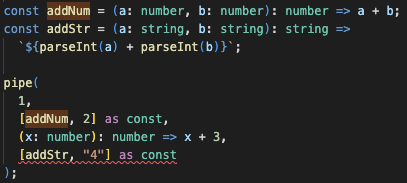
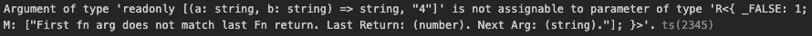

# Minimal Curry and Pipe

One Pipe to rule them all, 
<BR>
One Pipe to find them,
<BR>
One Pipe to bring them all
<BR>
and in the call stack bind them.


```js
onStep((result, target, index) => {
  KafkaProd.send({
    topic: "Users",
    messages: [
      {
        key: `UserLog:${User.id}`,
        value: `${index}: ${JSON.stringify(result)}`,
      },
    ],
  });
})
  .faultSafe()
  .pipe(
    User.id,
    [User.getToken] as const,
    [User.addPost, content] as const
  );
```





#### Pipe
* Dynamic and asynchronous pipe with full generic type safety
* Implicit pipelining (like Bash, Ruby, etc...)
* Composition pipelining (like RxJs, Ramda, etc...)
* Closure utilities to modify pipe behavior without altering the pipe itself. 
* Call partial standard functions as tuples without adding function wrappers
* Custom error handling for errors in pipe

#### Curry
* Curry utility for creating partially curried functions from standard functions
* Call any number of partial arguments in any number of chunks
* Automatic type inference for consumed partial functions and their child partials
* Custom error handling to avoid confuscation caused by function wrappers
* Inferred function naming for curried functions

[Full Doc](README_FULL.md)